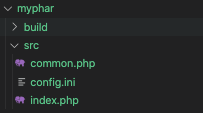

# 简单了解Phar代码打包工具的使用

Phar 是在 PHP5 之后提供的一种类似于将代码打包的工具。本质上是想依照 Java 的 Jar 文件那种形式的代码包，不过本身由于 PHP 是不编译的，所以这个 Phar 实际上就是将代码原样的进行打包，不会进行编译。但是我们可以对打包的 Phar 包进行压缩操作。

另外，实际上使用过 Phar 包的人非常少，特别是在 Composer 已经成为事实代码库标准的今天，Phar 就更加难觅踪影了。不过，Composer 的安装包本身也是一个 .phar 的打包文件。最主要的原因，一个是 Phar 这种形式的代码包安装并不像 Composer 一样的简单方便，另一方面，早期的程序员，特别是 LAMP/LAMP 的程序员，都喜欢去将开源的代码复制过来，而不喜欢直接使用一个工具包。毕竟，源代码在手上让我们更加踏实一些。其实，就算是 Composer 这样直接下载的就是源码，我们也从来没什么人真正的去翻过。而 Composer 相比 Phar 的最大优势，一个是代码的自动加载，另一个就是标准的 PSR 命令空间和目录规范。这两个在 Phar 中是没有的，所以我们要使用 Phar 包都必须要 require 一下。

虽说已经过时了，但我们还是简单的来学习了解一下。说不定在什么时候我们就能用上，特别是封装一些内部的公用库函数时，Phar 打包代码的这种方式还是非常有用的。

## 代码打包

我们先按标准格式建立一个目录树。



在这个目录树中，src 目录存放源码，build 目录用来存放生成后的 .phar 代码包。

```php
// index.php
<?php

require_once "phar://myphar.phar/common.php";

```

index.php 文件中，我们就是简单的引用 common.php 。注意这里使用的是 phar 伪协议来加载的 common.php 文件。关于伪协议的内容我们之前有过一篇文章进行过讲解。

```php
<?php
// common.php
class Manager{

    public static function run($config){
        echo "AAA", PHP_EOL;
        var_dump($config);
    }

    public static function ChineseMobile($mobile){
        if(preg_match("/^1[34578]\d{9}$/", $mobile)){
            return true;
        }
        return false;
    }
}
```

common.php 文件中只是提供了一个类和两个简单的方法用来测试。run() 方法就是简单的输出打印的内容和传递过来的参数。ChineseMobile() 方法则是我们提供的一个判断我们国内手机号的函数。

```php
[database]
host=localhost
db=dbname
user=myuser
pass=dbpass
```

config.ini 是一个配置文件，其实我们可以在 Phar 的代码中直接的进行配置文件的读取，也可以让配置文件随代码一起 build 到指定的目录。

源码文件准备好了，接下来就是要准备打包的编译文件了。

```php
// create-phar.php
$srcRoot = "./myphar/src";
$buildRoot = "./myphar/build";
 
$phar = new Phar($buildRoot . "/myphar.phar", 
  FilesystemIterator::CURRENT_AS_FILEINFO |       FilesystemIterator::KEY_AS_FILENAME, "myphar.phar");
$phar["index.php"] = file_get_contents($srcRoot . "/index.php");
$phar["common.php"] = file_get_contents($srcRoot . "/common.php");
$phar->setStub($phar->createDefaultStub("index.php"));

copy($srcRoot . "/config.ini", $buildRoot . "/config.ini");
```

代码并不复杂，主要是一个 Phar 类，这个类要指定生成文件的目录，文件名，然后使用 createDefaultStub() 方法来调用我们包的入口文件 index.php ，这个方法是用于创建指定的 .phar 文件的存根。其实就是指定一个入口文件，就像 Java 中的 main() 方法入口一样。

然后我们拷贝了 config.ini 文件到发布目录 build 中。

接着使用命令行运行这个 create-phar.php 文件，就能够生成这套代码包了。

```php
# php ./create-phar.php
```


使用文本编辑器打开 myphar.phar 文件，我们会发现里面竟然还是我们熟悉的 PHP 代码，拉到最底下，更会发现 index.php 和 common.php 的内容都被编译在这个文件中了。上面的那些自动生成的代码就是一些引导或者前置准备语句，是 Phar 扩展为我们准备好的内容，所有用户自己写的源码都会在这个文件的底部。也就是说，大家可以下载 Composer 的安装包，也就是那个 .phar 文件看看里面都写了什么东西。

接下来就是使用了，这个就非常简单了。

```php
$config = parse_ini_file("./myphar/build/config.ini");
require './myphar/build/myphar.phar';

Manager::run($config);
// AAA
// array(4) {
//   ["host"]=>
//   string(9) "localhost"
//   ["db"]=>
//   string(6) "dbname"
//   ["user"]=>
//   string(6) "myuser"
//   ["pass"]=>
//   string(6) "dbpass"
// }

var_dump(Manager::ChineseMobile('13811111111'));
var_dump(Manager::ChineseMobile('138111111112'));
// bool(true)
// bool(false)
```

## 压缩能力

前面说过，做为代码库来说，Phar 已经早就败给了 Composer ，但是它除了能够做为一些安装包来使用之外，本身 Phar 也是一个压缩工具。可以用来存档一些文件、文本、目录之类的内容。下面我就来简单看看对于文本的存档，Phar 是如何使用的。

```php
unlink('./my.phar');
unlink('./my.phar.bz2');
unlink('./my.phar.gz');
$p = new Phar('./my.phar', 0 ,'my.phar');
$p['myfile1.txt'] = 'hi1';
$p['myfile2.txt'] = 'hi2';
$p1 = $p->compress(Phar::GZ);
$p2 = $p->compress(Phar::BZ2);
unset($p);

$decompressPhar  = new Phar('./my.phar', 0 ,'my.phar');
foreach($decompressPhar as $file){
    // $file 是返回的 PharFileInfo 对象
    var_dump($file->getFileName());
    var_dump($file->isCompressed());
    var_dump($file->isCompressed(Phar::BZ2));
    var_dump($file->isCompressed(Phar::GZ));
    var_dump($file->getContent());
}
echo '==================', PHP_EOL;
// string(11) "myfile1.txt"
// bool(false)
// bool(false)
// bool(false)
// string(3) "hi1"
// string(11) "myfile2.txt"
// bool(false)
// bool(false)
// bool(false)
// string(3) "hi2"
```

首先，依然是实例化一个 Phar 类，然后我们给它像数组一样增加属性，这样，属性内容就被打包进了 .phar 文件中。通过直接查看 my.phar 文件，我们可以看出，myfile1.txt 这两个属性直接被写成了文件进行保存了，也就是说，它帮我们将文本转化成文件并打包在了 my.phar 这个压缩包文件中了。

compress() 方法则是将当前的这个 Phar 对象压缩存储为某个格式的文件。这里我们直接压缩了 Bzip2 和 GZ 文件。调用这个方法后直接就会生成对应的压缩文件。

Phar 对象在遍历时产生的对象是 PharFileInfo 对象，它拥有很多类似于 File 的文件操作函数。大家可能在官方文档中找到相关的说明。

假设我们遍历 my.phar.gz ，内容依然可以正常输出，但循环中的 isCompressed() 判断都依然会是 false ，难道文件没有被压缩吗？其实，我们需要通过另一个函数来让所有文件都进行统一格式的压缩。

```php
$p = new Phar('./my.phar', 0 ,'my.phar');
$p->compressFiles(Phar::GZ);
unset($p);

$decompressPhar  = new Phar('./my.phar.gz', 0 ,'my.phar');
foreach($decompressPhar as $file){
    // $file 是返回的 PharFileInfo 对象
    var_dump($file->getFileName());
    var_dump($file->isCompressed());
    var_dump($file->isCompressed(Phar::BZ2));
    var_dump($file->isCompressed(Phar::GZ));
    var_dump($file->getContent());
}
echo '==================', PHP_EOL;

// string(11) "myfile1.txt"
// bool(true)
// bool(false)
// bool(true)
// string(3) "hi1"
// string(11) "myfile2.txt"
// bool(true)
// bool(false)
// bool(true)
// string(3) "hi2"
```

使用 compressFiles() 对整个 .phar 中的所有文件进行了统一的格式压缩之后，再打印时 isCompressed() 就会返回对应格式的 true 了。

## 数据格式 Phar

最后，如果只是为了打包压缩功能的话，我们没必要使用 Phar 类。Phar 类最主要的还是用来打包能够运行的 PHP 源码，也就是它的 createDefaultStub() 方法非常重要。而如果只是打包普通文件的话，我们并不需要这个方法，这时，我们就可以使用另外一个 PharData 类来进行数据的打包压缩。使用方法和 Phar 类是一模一样的。同时，PharData 类可以直接打包成 tar 之类的文件。

```php
$p = new PharData('./myData.tar');
$p['myfile1.txt'] = 'hi1';
$p['myfile2.txt'] = 'hi2';

foreach($p as $file){
    var_dump($file->getFileName());
    var_dump($file->isCompressed());
    var_dump($file->isCompressed(Phar::BZ2));
    var_dump($file->isCompressed(Phar::GZ));
    var_dump($file->getContent());
}
echo '==================', PHP_EOL;
// string(11) "myfile1.txt"
// bool(false)
// bool(false)
// bool(false)
// string(3) "hi1"
// string(11) "myfile2.txt"
// bool(false)
// bool(false)
// bool(false)
// string(3) "hi2"
```

## 总结

说实话，Phar 真的是一个冷门项目，但是在某些情况中又非常有用，比如它虽然在代码包领域被 Composer 打败了，但是它又可以成为 Composer 的安装包，也就是说，没有 Phar 你就安装不了 Composer 。而做为压缩工具，虽然有强大的实力但使用的却也非常的少。因此，我们还是以了解为目的，如果感觉某些场景非常合适的话，也完全可以深入的研究拿来放到我们的实际项目中使用。毕竟它是 PHP 的一部分，不需要任何的编译安装及其它支持，非常原生。

测试代码：

[https://github.com/zhangyue0503/dev-blog/blob/master/php/202007/source/%E7%AE%80%E5%8D%95%E4%BA%86%E8%A7%A3Phar%E4%BB%A3%E7%A0%81%E6%89%93%E5%8C%85%E5%B7%A5%E5%85%B7%E7%9A%84%E4%BD%BF%E7%94%A8.php](https://github.com/zhangyue0503/dev-blog/blob/master/php/202007/source/%E7%AE%80%E5%8D%95%E4%BA%86%E8%A7%A3Phar%E4%BB%A3%E7%A0%81%E6%89%93%E5%8C%85%E5%B7%A5%E5%85%B7%E7%9A%84%E4%BD%BF%E7%94%A8.php)

参考文档：

[https://www.php.net/manual/zh/book.phar.php](https://www.php.net/manual/zh/book.phar.php)

[https://www.webhek.com/post/packaging-your-php-apps-with-phar.html](https://www.webhek.com/post/packaging-your-php-apps-with-phar.html)

[http://www.mamicode.com/info-detail-888559.html](http://www.mamicode.com/info-detail-888559.html)


