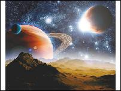

# 一起学习PHP中GD库的使用（三）

上篇文章我们已经学习了一个 GD 库的应用，那就是非常常用的制作验证码的功能。不过在现实的业务开发中，这种简单的二维码已经使用得不多了，大家会制作出更加复杂的二维码来使用。毕竟现在的各种外挂软件已经能够轻松地破解这种简单的图片验证码了。当然，我们也可以简单地对他进行变形，比如使用中文然后按顺序点击之类的，这些都比较简单地就能实现。更复杂的二维码则推荐使用一些开源的库或者api来实现。

今天，我们将继续学习 GD 库的一些常用的应用。依然是通过一些小例子来进行学习，同样也是我们在日常开发中非常常用的一些功能。

## 生成缩略图

在日常的开发过程中，不管是客户还是我们自己在后台上传的图片，大小可能都不一定是我们需要的尺寸，这个时候缩略图的功能就比较重要了。一般我们会在保留原图的基础上生成对应原图的一张缩略图用于前台统一尺寸页面的展示。

```php
$w = imagesx($im);
$h = imagesy($im);

$imNew = imagecreatetruecolor($w / 2, $h / 2);

imagecopyresized($imNew, $im, 0, 0, 0, 0, $w / 2, $h / 2, $w, $h);

header("Content-type: image/jpg");
imagejpeg($imNew);
imagedestroy($imNew);
```

上述代码中，我们生成的缩略图是原图的一半大小，使用的就是 imagecopyresized() 这个函数，它的参数依次是新图画布、原图、新图的x和y坐标起始点、原图的x和y坐标起始点、新图的大小、原图的大小。参数比较多，但也比较好理解，就是将原图缩小到指定的大小并放到新的画布上就可以了。


imagesx() 和 imagesy() 函数不要从字面理解为什么 x 、 y 坐标点之类的，它们其实是获得图像句柄文件的宽和高。如果我们输出的是 jpg 格式的图片，还可以指定它的压缩比率。

```php
$w = imagesx($im);
$h = imagesy($im);

$imNew = imagecreatetruecolor($w / 2, $h / 2);

imagecopyresized($imNew, $im, 0, 0, 0, 0, $w / 2, $h / 2, $w, $h);

header("Content-type: image/jpg");
imagejpeg($imNew, null, 10);
imagedestroy($imNew);
```

也就是 imagejpeg() 函数的最后一个参数，就和 PS 导出图片时的压缩比率一样，如果数字越小，压缩比越高，数字越大，压缩比越低，图片质量也就越好。默认值为 75 ，可以设置从 0 到 100 的压缩比。第二个参数依然是保存图片的路径，我们这里测试的代码还是直接从浏览器输出的，所以我们这里是给的一个 null 。


从图片的画质来看，确实比上一张直接缩小的图片模糊了许多。当然，图片的大小也小了很多。对于网站的优化来说，jpg 图片的压缩比例一般都会在默认值的 75 左右。如果太小就会出现这种过于模糊的情况从而影响用户的体验。具体业务具体分析，需要多大的图片大小还是要根据我们实际的情况来定。

### 生成指定大小的等比较缩略图

还有一种业务情况是，我们前台的图片展示大小都是一样的，比如商品图片在列表中的显示。这时，很多图片直接压缩可能就会丢失比例，比如我们上传了一张 16:9 的大宽图，而前台列表页的图片位置是 4:3 的图，这里我们就要等比例按照最大宽度或者最大高度进行缩小，同时多出来的部分留白边或者透明边，这时，只要计算一下图片的比例情况就可以了。

```php
$w = imagesx($im);
$h = imagesy($im);

$imNew = imagecreatetruecolor(202, 152);
imagefill($imNew, 0, 0, imagecolorallocate($imNew, 255, 255, 255));
imagerectangle($imNew, 0, 0, 201, 151, imagecolorallocate($imNew, 0, 0, 0));

$sW = 0;
$sH = 0;
if ($w / $h > 200 / 150) {
    $q = 200 / $w;
    $sH = $h * $q;
    $sW = $w * $q;
    $sX = 0;
    $sY = (150 - $sH) / 2;
} else {
    $q = 150 / $h;
    $sH = $h * $q;
    $sW = $w * $q;
    $sX = (200 - $sW) / 2;
    $sY = 0;
}

imagecopyresized($imNew, $im, $sX + 2, $sY + 1, 0, 0, $sW, $sH, $w, $h);

header("Content-type: image/jpg");
imagejpeg($imNew);
imagedestroy($imNew);
```

在测试代码中，我们规定的大小是 200\*150 的图片大小，也就是 4:3 的图片规格。而需要操作的图片则是 300\*244 的一张不太规范的图片。这时，我们通过计算 宽/高 的比例，来确定是以宽为基准进行缩小还是以高为基准进行缩小。如果原图的宽高比大于我们规定的图片宽高比，则认为是以宽度为基准进行缩小。反之，就是以高度进行缩小。同样地，具体的宽高结果的算法都都是基于对应的比率进行等比例缩小的。同时，我们还要计算图片的位置，要放在居中的位置。最后，再将缩小的大小放入到指定大小的画布中。



我们这段测试代码中的画布多了两个像素，是为了画那个黑色的边框，目的也是为了演示能够看清楚。

可以看到，我们等比例缩放之后是以原图的高为基准进行缩放的，所以图片的两边会出现白边。如果是以宽为基准的，那么图片上下会出现白边。当然，如果原图的比例和我们需要的比例是一样的，就会完整地撑满整个画布。大家可以自己用其它大小的图片测试一下。

## 图片加水印

除了缩略图之外，加水印的功能也是很多业务开发中必备的功能。直接的文字水印其实就不用多说了，上篇文章中的 imagettftext() 就可以直接加了，只需要给它用 imagecolorallocatealpha() 函数指定一个带透明的颜色就可以了。今天我们主要来讲的是图片水印的添加。

```php
$imNew = imagecreatetruecolor(150, 30);

imagecolortransparent($imNew, imagecolorallocatealpha($imNew, 255, 255, 255, 128));
imagesavealpha($imNew, true);

$font = '../font/msyh.ttf';
imagettftext($imNew, 16, 0, 11, 21, imagecolorallocate($imNew, 255, 255, 255), $font, '硬核项目经理');

if (imagesx($im) > 150 + 10 && imagesy($im) > 60 + 10) {
    imagecopy($im, $imNew, imagesx($im) - 150 - 10, imagesy($im) - 30 - 10, 0, 0, 150, 30);

    imagecopymerge($im, $imNew, imagesx($im) - 150 - 10, imagesy($im) - 60 - 10, 0, 0, 150, 30, 50);
}

header("Content-type: image/jpg");
imagejpeg($im);
imagedestroy($im);
```

首先，我们通过 imagecolortransparent() 和 imagesavealpha() 指定一个透明画布。然后通过 imagettftext() 生成一张文字图片。注意，这里是图片哦，不是直接添加的文字。

接着，使用 imagecopy() 或 imagecopymerge() 来将水印图片拷贝到原始图片上。这两个函数的区别就是 imagecopymerge() 在图片合并的时候多了一个参数可以指定通道的透明度，也就是说，如果是一张不带透明度的图片可以直接使用这个函数来让图片增加透明的效果。

在添加水印之前的判断是用于判断图片大小是否适合添加水印，如果图片比水印文件还小的话，那么就不要添加水印了，或者再将水印也缩小后再进行添加。


这样，简单地水印添加就完成了。网上其实能找到很多前辈已经封装好的添加水印的类，或者 Composer 中也有很多现成的库，这里只是手写一个简单的效果供大家学习复习。

## 总结

关于图片 GD 库的功能函数还有很多，但说实话，笔者现在都已经用得不多了。为什么呢？在实际的业务开发中，大家其实都已经习惯使用 oss 、七牛、upyun 之类的云存储了。不管是图片缩放、添加水印，甚至是简单地进行一些 PS 编辑，都非常方便。而且最主要的是不需要再占用我们的服务器存储资源以及带宽资源，何乐而不为呢。像我现在的工作中，程序代码服务器基本上只需要原始的 20G 左右大小就可以了，只是运行代码，不存储图片上传的文件、图片以及静态资源。

测试代码：

参考文档：

[https://www.php.net/manual/zh/book.image.php](https://www.php.net/manual/zh/book.image.php)